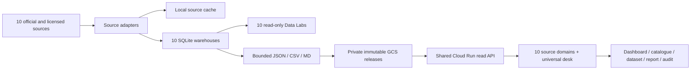

# Osnova Ukrainian Dataroom Architecture

## Decision

Use one SQLite warehouse per source for ingestion, schema discovery,
data-quality checks, and local SQL. Publish bounded JSON, CSV, and Markdown
files as immutable GCS releases. Keep the browser serverless: Cloudflare
serves one shared React shell and proxies reads to one scale-to-zero Cloud Run
API.

## Storage Contract

- `data/<corner>-dataroom.sqlite` is the local analytical store.
- `data/cache/<corner>` contains source responses for reproducible rebuilds.
- `public/data/<corner>/dashboard.json` is the small homepage payload.
- `public/data/<corner>/dataroom/manifest.json` is the catalogue entrypoint.
- `public/data/<corner>/dataroom/<id>/summary.json` powers one dataset page.
- `latest-NNN.json` and `latest-NNN.csv` are bounded on-demand raw chunks.
- `annual.csv` is the compact chart/export series.
- `reports/{annual,latest,freshness}.{json,md}` are reader-facing reports.
- `public/data/ukraine/{universal,comparisons}.json` powers cross-source views.

No route downloads an entire source. Eurostat can expose 648,093 observations
while its initial page loads only a compact manifest and selected charts.

## Source Semantics

Open Budget monthly values are cumulative year-to-date. An annual point is the
last published period for that year; months are never summed. The current year
is partial and is not compared as a final annual result.

OECD values apply `UNIT_MULT` before storage. World Bank source `2` is WDI and
source `27` is GEP. ILOSTAT classifications and observation statuses are
preserved. IMF uses projection-year metadata for forecast flags. Eurostat
stores every returned dimension and retains raw JSON-stat cells. Comtrade
keeps flow, partner, customs system, and HS dimensions. Trading Economics
public snapshots are never presented as full authenticated history.

Interrupted series remain visible with notes. Forecast chart segments are
dashed and forecast points are labeled in hover text. Current-year annual
points use the latest available publication and are marked partial rather than
replaced with zero.

## Universal Semantic Layer

The universal catalogue indexes source metadata without merging warehouses.
Five curated comparison families map source-specific codes for GDP growth,
inflation, unemployment, public debt, and external balance. Comparisons require
compatible units, frequencies, price bases, populations, and status flags.

IMF WEO, World Bank GEP, and Trading Economics forecasts remain separate
trajectories. This lets a researcher compare assumptions without averaging
incompatible releases.

## Release Safety

1. Build source-specific SQLite and public files locally.
2. Run data, type, UI, and Cloud Run API tests.
3. Upload to `gs://osnova-496915-prototype-data/<corner>/releases/<id>/data`.
4. Call the authenticated Cloud Run refresh route.
5. Cloud Run verifies required manifests before changing `current.json`.
6. Publish the universal release after its source releases.
7. Deploy the data-free Cloudflare shell after every API release is live.

Immutable files use long cache lifetimes. The current pointer is uncached, so
rollback is a pointer change rather than a rebuild.

## Cost and Scale

- GCS stores cold and immutable data cheaply.
- Cloud Run remains at zero minimum instances and streams bounded objects.
- Cloudflare caches public GET responses close to readers.
- SQLite avoids an always-on database for research workloads.
- High-cardinality cubes stay on demand and can move to BigQuery only when
  concurrent analytical querying justifies the cost.
- Weekly source refreshes can run from Codex or a future Cloud Run Job without
  changing the public contract.
